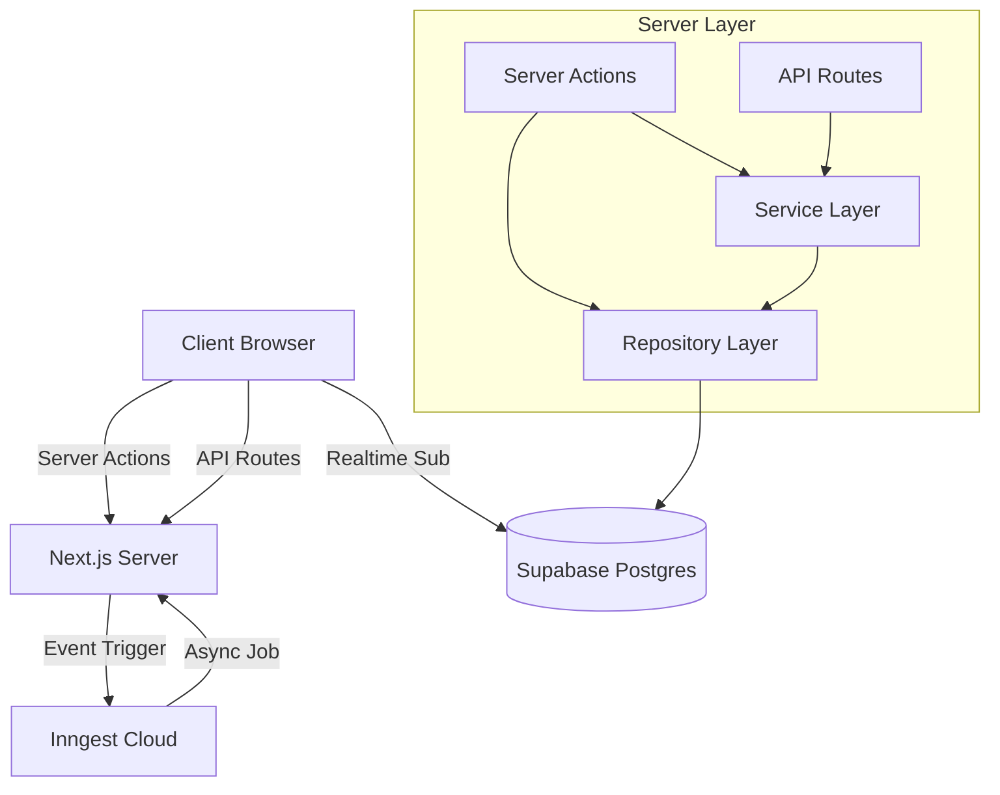

# System Architecture Analysis

This document provides a detailed analysis of the **Pulse Event Platform** architecture. It outlines the structural components, data flow, technology stack, and design patterns used to build the scalable, event-management system.

## 1. Executive Summary

The application is a modern, full-stack event management platform built on **Next.js 16 (App Router)**. It leverages **Supabase** for its backend infrastructure (Authentication, Database, Realtime) and implements a robust **Repository Pattern** to decouple business logic from data access. The frontend is built with **React 19**, styled with **Tailwind CSS v4**, and features complex integrations with **Web3** (Solana/Ethereum wallet adapters) and **Inngest** for background job processing.

**Key Strengths:**
- **Strict Separation of Concerns**: Repository and Service layers keep the API routes and Actions clean.
- **Type Safety**: Extensive use of TypeScript with generated Supabase definitions (`database.types.ts`).
- **Scalability**: Usage of Server Actions and Inngest for async tasks ensures the app handles heavy loads (e.g., mass invites) gracefully.
- **Modern Stack**: Adoption of bleeding-edge versions (Next.js 16, React 19, Tailwind v4).

## 2. Technology Stack

### Core Framework
- **Frontend/Fullstack**: Next.js 16.0.0 (App Router), React 19.0.0
- **Language**: TypeScript 5.8.2
- **Styling**: Tailwind CSS v4.0.0, Framer Motion (animations), Lucide React (icons)

### Backend & Infrastructure
- **Database**: PostgreSQL (via Supabase)
- **Auth**: Supabase Auth (Social + Email)
- **ORM/Query Builder**: Supabase JS Client (v2.90.1)
- **Background Jobs**: Inngest (v3.49.1)
- **Storage**: Supabase Storage

### Web3 Integration
- **EVM**: Wagmi, Viem, Ethers.js
- **Solana**: @solana/web3.js, Wallet Adapter

### Deployment
- **Platform**: Vercel
- **Environment Management**: `.env` / `.env.local`

## 3. High-Level Architecture

The application follows a standard **Next.js App Router** architecture, enhanced with a Layered Architecture pattern to manage complexity.

## 4. Key Components and Patterns

### 4.1. Directory Structure (`src/`)

- **`app/`**: Next.js 16 routing. Contains pages (`page.tsx`), layouts (`layout.tsx`), and API routes (`api/`).
- **`actions/`**: Server Actions. These are the primary entry points for mutations (e.g., `subscription.actions.ts`). They validate input and call into the Service or Repository layer.
- **`lib/repositories/`**: **The Data Access Layer**.
    - Abstracts raw Supabase queries.
    - Handles client instantiation: `getPublicClient()` for read-only/public data and `getAdminClient()` for service-role operations.
    - **Example**: `event.repository.ts` has methods like `findAll()`, `create()`, which return typed objects (e.g., `Event`).
    - **Normalization**: Repositories map raw database rows (snake_case) to application domain models (camelCase) to ensure consistent consumption in the UI.
- **`lib/services/`**: **The Business Logic Layer**.
    - Orchestrates complex flows involving multiple repositories or external APIs.
    - **Example**: `invite.service.ts` handles the multi-step process of creating a database record *and* sending an email via Resend API.
- **`components/features/`**: **The Feature-Based UI**.
    - Components are organized by domain (e.g., `chat`, `events`, `tickets`) rather than type, improving modularity.

### 4.2. Data Flow Pattern

1.  **Read Path**:
    - **Server Components**: Directly call Repository functions (e.g., `await eventRepo.findAll()`). This bypasses the API layer for efficiency.
    - **Client Components**: Uses wrappers or Server Actions to fetch data.
2.  **Write Path**:
    - **UI Interaction**: User clicks a button (e.g., "Subscribe").
    - **Server Action**: `subscribeToCalendarAction` is invoked.
    - **Repository Call**: Action calls `calendarRepo.subscribe(...)`.
    - **Database**: Repository executes Supabase `insert`.
    - **Revalidation**: Action calls `revalidatePath('/')` to refresh the UI.

### 4.3. Type Safety

- **`database.types.ts`**: Generated from Supabase. Acts as the Single Source of Truth for the schema.
- **Domain Types (`src/types/*.ts`)**: Hand-written interfaces (e.g., `Event`, `Calendar`) that the application consumes.
- **Normalization**: Repositories are responsible for converting `Database['public']['Tables']['events']['Row']` -> `Event`.

## 5. Data Architecture (Supabase)

Based on the repositories observed, the core schema encompasses:
- **`events`**: Core entity.
- **`calendars`**: A grouping entity for events (one-to-many).
- **`calendar_people`**: CRM-like table tracking audience interactions.
- **`calendar_subscriptions`**: Tracks user subscriptions to calendars.
- **`invitations`**: Tracks event invites.
- **`ticket_tiers`**: Commerce entity for monetization.
- **`users/profiles`**: Extended user data linked to Supabase Auth.

## 6. Infrastructure and Deployment

- **Supabase**: Central hub for state. "Service Role" keys are used judiciously in Repositories for privileged operations.
- **Inngest**: Background jobs are located in `src/inngest` (e.g., sending email reminders).
- **Environment Config**: Strictly managed via `next.config.ts` and `.env` files.
