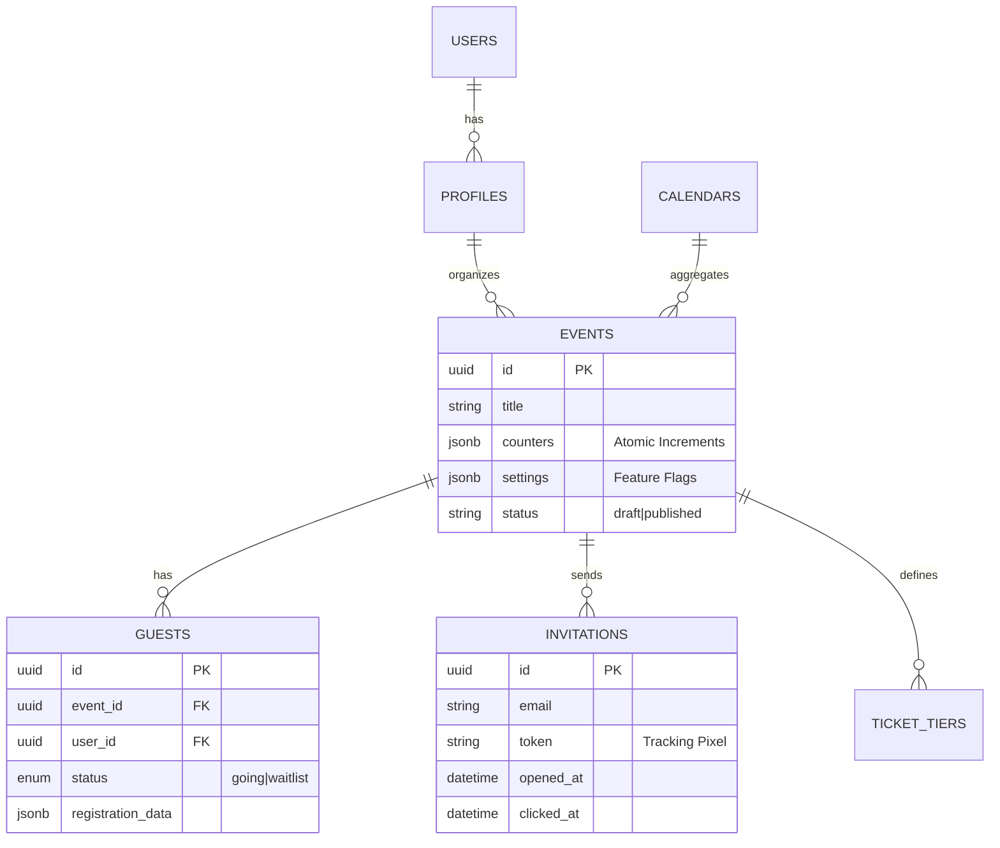

# PlanX System Architecture Definitions

**Version:** 2.0.0
**Status:** Live / Active Development
**Document Owner:** Senior System Architect

---

## 1. Executive Summary

PlanX is a **Serverless, Event-Driven Event Management Platform** engineered to bridge Web2 usability with Web3 capabilities. It is built on a **Modern Composable Architecture**, leveraging Next.js 16 for the application layer and Supabase for the persistence and realtime layer.

The architecture prioritizes:
1.  **Scalability**: Leveraging serverless compute (Vercel/Supabase Functions) to handle bursty traffic typical of event ticketing.
2.  **Type Safety**: End-to-end type safety from Database (SQL) to UI (React) via generated TypeScript definitions.
3.  **Performance**: Aggressive caching strategies, localized edge rendering, and optimistic UI updates.
4.  **Separation of Concerns**: Strict adherence to the Repository Pattern to decouple business logic from data access.

---

## 2. C4 Architecture Model

### Level 1: System Context Diagram
*High-level view of how PlanX interacts with the ecosystem.*

```mermaid
graph TB
    User[Web / Mobile User]
    
    subgraph PlanX_Platform [PlanX Platform]
        WebApp[Next.js Application]
    end
    
    subgraph External_Systems [Infrastructure & Integrations]
        Supabase[Supabase PaaS\n(Auth, DB, Realtime, Storage)]
        Stripe[Stripe Payments\n(Fiat Processing)]
        Blockchain[Blockchain Nodes\n(Solana/EVM)]
        Inngest[Inngest\n(Durable Queues & Jobs)]
        Resend[Resend\n(Transactional Email)]
    end

    User -->|HTTPS| WebApp
    WebApp -->|SQL/Rest| Supabase
    WebApp -->|API| Stripe
    WebApp -->|RPC| Blockchain
    WebApp -->|Events| Inngest
    Inngest -->|SMTP| Resend
    Inngest -->|Write| Supabase
```

### Level 2: Container Diagram
*Detailed breakdown of the application structure and data flow.*

```mermaid
graph TB
    subgraph Client_Layer [Frontend (Browser)]
        NextClient[Next.js Client Components]
        Zustand[Global Store (Zustand)]
        ReactQuery[Server State Cache]
    end

    subgraph Service_Layer [Backend (Serverless)]
        NextAPI[Next.js API Routes]
        RepoLayer[Repository Layer\n(Data Access Object)]
        Services[Domain Services\n(Business Logic)]
    end

    subgraph Data_Layer [Persistence]
        Postgres[(PostgreSQL DB)]
        Realtime(Realtime Socket)
        Buckets[[Object Storage]]
    end

    NextClient -->|Fetch/RPC| NextAPI
    NextClient -->|Subscribe| Realtime
    
    NextAPI -->|Call| Services
    Services -->|Use| RepoLayer
    RepoLayer -->|Query| Postgres
    
    Postgres -.->|CDC| Realtime
```

---

## 3. Data Architecture (ERD)

The database (PostgreSQL) is the source of truth, normalized to 3NF. Key entities utilize `UUID` primary keys.



**Key Data Decisions:**
*   **JSONB Columns**: Used for flexible schema evolution (e.g., `events.settings`, `events.counters`) without schema migrations for minor attributes.
*   **Atomic Counters**: `events.counters` utilizes Postgres atomic increments to handle high-concurrency RSVP scenarios without locking issues.
*   **Row Level Security (RLS)**: Security logic is pushed to the database layer. No query can bypass tenant isolation rules defined in SQL policies.

---

## 4. Component Design & Patterns

### 4.1. The Repository Pattern
We enforce a strict boundary between the Application Layer and the Data Layer.
*   **Path**: `src/lib/repositories/*`
*   **Responsibility**:
    *   Construct complex SQL queries.
    *   Map DB `snake_case` types to Application `camelCase` types.
    *   Handle `PGRST` errors and return domain-specific Results.
*   **Why?**: Allows us to swap backing stores or mock data easily. It creates a "Corruption Layer" that protects the UI from Database Schema changes.

### 4.2. Strategy Pattern for Payments
The payment system (`/api/payments`) supports multiple processors via a unified interface.
*   **Interfaces**: `PaymentProcessor` (Abstract)
*   **Implementations**: `StripeProcessor`, `CryptoProcessor` (Solana/EVM)
*   **Benefit**: Adding a new payment method (e.g., PayPal) requires zero changes to the core Checkout flow.

### 4.3. Event-Sourcing (Lite)
While not full Event Sourcing, critical actions emit domain events to **Inngest**.
*   **Example**: `invitation.created`
*   **Consumers**:
    *   `send-email`: Triggers Resend.
    *   `update-analytics`: Increments stats.
    *   `audit-log`: Records activity.
*   **Benefit**: Decouples side effects from the critical user path. User gets a fast response; emails send asynchronously.

---

## 5. Security Posture

### 5.1. Authentication & Authorization
*   **Auth**: Supabase Auth (JWT based).
*   **Authorization**:
    *   **Level 1 (Edge)**: Next.js Middleware validates JWT presence.
    *   **Level 2 (Database)**: Postgres RLS Policies enforce ownership (e.g., `auth.uid() == organizer_id`).
    *   **Level 3 (API)**: Service layer validation for business rules (e.g., "Cannot invite to past event").

### 5.2. Data Protection
*   **Inputs**: All API inputs validated via **Zod** schemas.
*   **SQL Injection**: Impossible due to usage of Parameterized Queries (via Supabase SDK).
*   **CSRF**: Handled natively by Next.js & SameSite cookie policies.

---

## 6. Scalability & Performance Strategy

### 6.1. Search Optimization
*   **Current**: Federated SQL Search (ILike).
*   **Scaling Path**: Shift to **meilisearch** or **ElasticSearch** when >100k records. The Repository pattern facilitates this swap transparently.

### 6.2. Caching Strategy
*   **Server**: Next.js `unstable_cache` (Tag-based revalidation) for public event pages.
*   **Client**: React Query `staleTime` (5min) for dashboard data to minimize network chatter.
*   **Database**: Materialized Views for heavy aggregation queries (Analytics dashboards).

### 6.3. Edge Computing
*   Geolocation-based routing is handled at the Edge (Vercel) to serve the nearest database replica read-node (future optimization).

---

## 7. Developer Experience (DX)

*   **Monorepo-style structure**: Feature collocation in `src/components/features`.
*   **Type Generation**: `supabase gen types` command synchronizes DB schema to TypeScript interfaces automatically.
*   **Local Development**: `pnpm run dev:all` orchestrates Next.js, Inngest Dev Server, and Supabase local stack.
