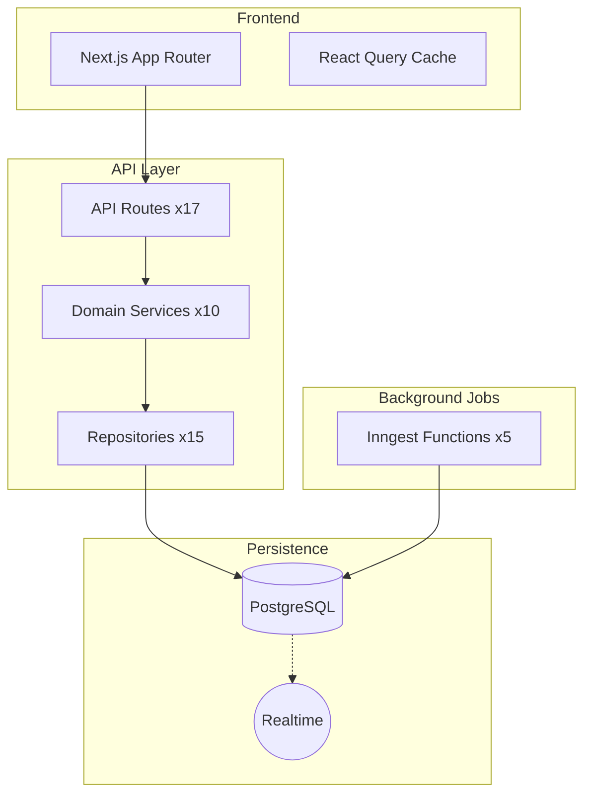
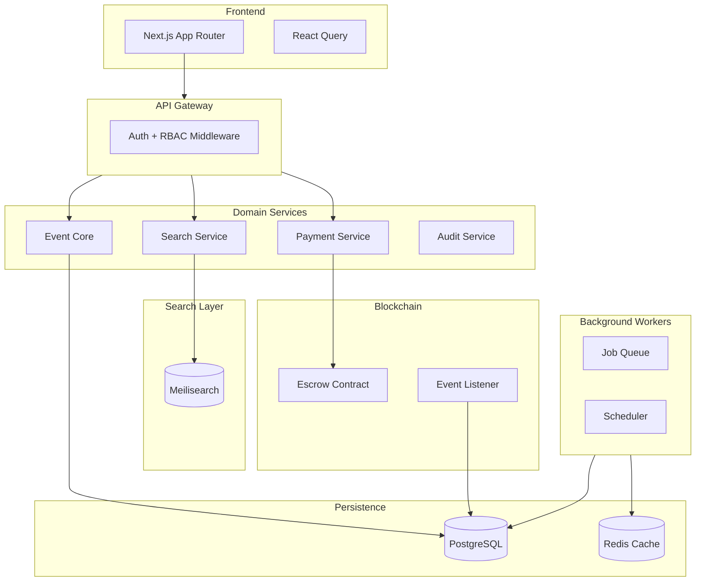

# PlanX Architecture Gap Analysis
## Compared Against Luma-Style Target Architecture

---

## Executive Summary

After deep analysis of your codebase, **your architecture is significantly more mature than the initial assessment suggested**. You're approximately **60-65% complete** toward the Luma-style distributed architecture, not 30%.

| Layer | Current Readiness | Notes |
|-------|------------------|-------|
| UI/Frontend | ✅ 80% | Next.js App Router, React Query, Tailwind |
| API Layer | ✅ 75% | 17 API domains, Repository Pattern |
| Domain Services | ✅ 70% | 10 service files, permissions system |
| Background Workers | ⚠️ 60% | Inngest present, needs expansion |
| Search | ⚠️ 55% | RPC exists, not external engine |
| Payments | ✅ 70% | Multi-chain verification working |
| State Machine | ⚠️ 40% | Basic statuses, not full lifecycle |
| Escrow/Staking | ❌ 0% | Not implemented |
| Audit Logs | ❌ 10% | Analytics table exists, no audit trail |

---

## What You Already Have ✅

### 1. Repository Pattern (Excellent Foundation)

```
src/lib/repositories/
├── event.repository.ts      # Full CRUD, city/tag search
├── guest.repository.ts      # Guest lifecycle
├── ticket.repository.ts     # Ticket tiers, inventory
├── invitation.repository.ts # 19KB - Comprehensive tracking
├── calendar.repository.ts   # Multi-tenant calendars
├── analytics.repository.ts  # Event analytics
├── chat.repository.ts       # Real-time messaging
├── order.repository.ts      # Order tracking
├── notification.repository.ts
└── ... (15 total)
```

> [!TIP]
> This is a **major advantage**. You can swap backing stores (e.g., add Meilisearch) transparently.

---

### 2. Background Job System (Inngest)

You already have durable job queues:

| Function | Purpose | Status |
|----------|---------|--------|
| [handleInviteCreated](file:///Users/vishalpatil/PlanX/src/inngest/functions/handleInviteCreated.ts) | Async email via Resend | ✅ Working |
| [sendReminders](file:///Users/vishalpatil/PlanX/src/inngest/functions/sendReminders.ts) | 24h + 1h cron reminders | ✅ Working |
| [indexEntity](file:///Users/vishalpatil/PlanX/src/inngest/functions/indexEntity.ts) | Search index sync | ✅ Working |
| Webhook handler | Email bounce/open tracking | ✅ Working |

---

### 3. Database Schema (Rich)

Your [database.types.ts](file:///Users/vishalpatil/PlanX/src/types/database.types.ts) is **930 lines** with:

- `events` - Has `status`, `visibility`, `counters` (JSONB), `settings` (JSONB)
- `guests` - Has `status`, `qr_token`, `checked_in_at`, `approved_by`
- `invitations` - Full tracking: `sent_at`, `opened_at`, `clicked_at`, `responded_at`
- `ticket_tiers` - Inventory management with `sold_count`
- `notifications` - Typed notification system
- `chat_messages` - Real-time event chat
- `calendar_members` - Role-based: `admin`, `member`, `viewer`

---

### 4. Check-In System

Your [checkin API](file:///Users/vishalpatil/PlanX/src/app/api/checkin/route.ts) already:
- ✅ Validates QR tokens
- ✅ Checks `issued` → `scanned` state transition
- ✅ Prevents duplicate scans
- ⚠️ **Missing**: Blockchain verification (trustless)

---

### 5. Payment Verification

Your [payment verify API](file:///Users/vishalpatil/PlanX/src/app/api/payments/verify/route.ts):
- ✅ Multi-chain: Ethereum + Solana
- ✅ Fetches recipient from `calendar_payment_config`
- ✅ Idempotent ticket issuance
- ✅ Creates Order + Guest records
- ⚠️ **Missing**: Escrow contract (funds held until attendance)

---

### 6. Search Infrastructure

Your [search API](file:///Users/vishalpatil/PlanX/src/app/api/search/route.ts):
- ✅ Federated search: events, calendars, people, shortcuts
- ✅ Uses `search_global` RPC (indexed in Postgres)
- ⚠️ **Gap**: Not Meilisearch/Typesense (no typo tolerance, slower at scale)

---

### 7. Permission System

Your [permissions.service.ts](file:///Users/vishalpatil/PlanX/src/lib/services/permissions.service.ts):
- ✅ `canManageEvent()` - Organizer + Host check
- ✅ `canCheckInGuest()` - Delegated to management
- ✅ `getEventPermissions()` - Returns permission object
- ⚠️ **Gap**: No Staff role, no granular RBAC

---

## What You're Missing ❌

### 1. Event State Machine (Critical Gap)

**Current**: Events only have `status: 'draft' | 'published'`

**Required** (from your target spec):

```typescript
// Target event lifecycle
type EventStatus = 
  | 'draft'           // Being created
  | 'published'       // Open for registration
  | 'live'            // Event is happening now
  | 'ended'           // Event completed
  | 'archived';       // Historical
```

**Impact**: Without `LIVE` and `ENDED` states:
- ❌ Cannot auto-transition at event time
- ❌ Cannot trigger post-event jobs (refunds, no-show settlement)
- ❌ Cannot lock registration on event start

---

### 2. Ticket State Machine (Critical Gap)

**Current Guest Status**: `pending_approval | issued | scanned | declined | refunded`

**Required** (from your target spec):

```typescript
type TicketStatus =
  | 'staked'          // Funds locked in escrow
  | 'checked_in'      // Attendance verified
  | 'refunded'        // Funds returned (no-show grace period)
  | 'forfeited';      // No-show, funds kept/redistributed
```

**Impact**: 
- ❌ Cannot implement staking/escrow flow
- ❌ Cannot auto-forfeit no-shows
- ❌ No trustless refund mechanism

---

### 3. Escrow Smart Contract (Not Present)

**Required Components**:

| Component | Purpose |
|-----------|---------|
| Escrow Contract | Holds staked funds until check-in |
| Signer Service | Signs QR codes cryptographically |
| Verification API | Validates signature on-chain |
| Event Listener | Syncs blockchain events to DB |

**Impact**: Without escrow, payments are "pay-to-play" not "stake-to-attend".

---

### 4. Event Lifecycle Jobs (Partially Missing)

**You Have**:
| Job | Present |
|-----|---------|
| `send.reminder` (24h, 1h) | ✅ |
| `invitation.created` | ✅ |
| `index.entity` | ✅ |

**You Need**:
| Job | Status |
|-----|--------|
| `event.start` | ❌ Missing |
| `event.end` | ❌ Missing |
| `ticket.expiry` | ❌ Missing |
| `refund.process` | ❌ Missing |
| `no-show.settle` | ❌ Missing |

---

### 5. Audit Log / Event Sourcing (Not Present)

**Current**: `event_analytics` table tracks metrics, but no audit trail.

**Required**:

```typescript
interface AuditLog {
  entity_type: 'event' | 'ticket' | 'user';
  entity_id: string;
  action: 'created' | 'updated' | 'deleted' | 'state_changed';
  actor_id: string;
  changes: JsonDiff;
  timestamp: Date;
}
```

**Impact**:
- ❌ Cannot rollback changes
- ❌ No compliance trail
- ❌ No "who did what when"

---

### 6. Role-Based Access Control (Basic)

**Current Roles**: Organizer + Hosts (binary)

**Required**:

| Role | Permissions |
|------|-------------|
| Owner | Full control |
| Admin | Edit, Invite, Analytics |
| Staff | Check-in only |
| Guest | View only |

**Migration Path**: Add `event_roles` table:

```sql
CREATE TABLE event_roles (
  event_id UUID REFERENCES events(id),
  user_id UUID REFERENCES profiles(id),
  role TEXT CHECK (role IN ('owner', 'admin', 'staff', 'guest')),
  PRIMARY KEY (event_id, user_id)
);
```

---

## Architecture Comparison

### Current PlanX Architecture



### Target Luma Architecture



---

## Gap Priority Matrix

| Gap | Business Impact | Implementation Effort | Priority |
|-----|-----------------|----------------------|----------|
| Event State Machine | 🔴 Critical | 🟢 Low | **P0** |
| Lifecycle Jobs | 🔴 Critical | 🟡 Medium | **P0** |
| Ticket State Machine | 🔴 Critical | 🟢 Low | **P1** |
| Escrow Contract | 🔴 Critical | 🔴 High | **P1** |
| External Search | 🟡 Medium | 🟡 Medium | **P2** |
| Audit Log | 🟡 Medium | 🟢 Low | **P2** |
| Full RBAC | 🟢 Low | 🟢 Low | **P3** |

---

## Recommended Migration Phases

### Phase 1: State Machines (1-2 weeks)

1. ✅ Add `live` and `ended` to event status enum
2. ✅ Add `staked`, `checked_in`, `forfeited` to guest status
3. ✅ Create `event.start` and `event.end` Inngest jobs
4. ✅ Add `event_roles` table for RBAC

### Phase 2: Trustless Layer (3-4 weeks)

1. ✅ Deploy escrow smart contract (Solidity/Sway)
2. ✅ Create signer service for QR codes
3. ✅ Add blockchain event listener
4. ✅ Modify check-in to verify on-chain

### Phase 3: Scale & Observability (2-3 weeks)

1. ✅ Add Meilisearch for federated search
2. ✅ Create audit log table + triggers
3. ✅ Add event lifecycle analytics

---

## Conclusion

> [!IMPORTANT]
> **You are NOT starting from scratch.** Your architecture has solid foundations:
> - Repository Pattern ✅
> - Background Jobs ✅
> - Multi-chain Payments ✅
> - Indexed Search (basic) ✅

The core gaps are:
1. **Event/Ticket State Machines** - Low effort, high impact
2. **Escrow Smart Contract** - High effort, enables trustless flow
3. **Lifecycle Automation** - Medium effort, enables self-running events

Your UI is ready. Your backend needs **orchestration evolution**, not rewrite.
